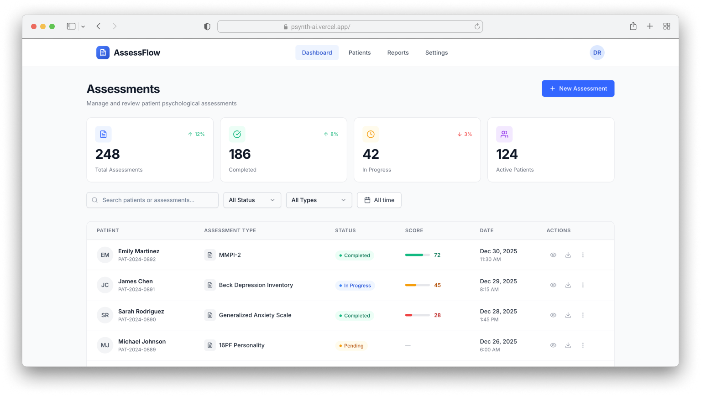

# AssessFlow Dashboard

> **Technical Challenge:** Front-End Engineer Assessment for Psynth

A production-ready patient assessment management dashboard built with React 19, TypeScript, and Tailwind CSS.

## Live Demo

**[https://psynth-ai.vercel.app](https://psynth-ai.vercel.app)**



## Challenge Overview

This project was built as part of the Psynth Front-End Engineer technical assessment. The goal was to create a functional dashboard for managing psychological assessments with:

- Stats overview cards
- Filterable assessment table (search, status, type, date range)
- Responsive design (desktop table / mobile cards)
- Detail panel with score visualization
- Loading states and empty states

## Quick Start

```bash
npm install
npm run dev
```

## Tech Stack

| Category | Technology |
|----------|------------|
| Framework | React 19 + TypeScript |
| Build Tool | Vite |
| UI Components | ShadCN UI (Radix primitives) |
| Styling | Tailwind CSS |
| Testing | Vitest + React Testing Library |
| State | Custom hooks (`useAssessments`) |

## Features

- **Stats Grid:** Total, pending, completed, average score
- **Filters:** Search (debounced 300ms), status, type, date range presets
- **Table/Cards:** Desktop table view, mobile card view
- **Pagination:** Client-side with page size of 5
- **Detail Panel:** Slide-over with score gauge visualization
- **Loading Skeletons:** Shimmer animations during load
- **Accessibility:** ARIA labels, keyboard navigation, focus management

## Project Structure

```
src/
├── components/
│   ├── ui/              # ShadCN base components
│   ├── layout/          # Header, Layout
│   └── dashboard/       # Domain components (Table, Cards, Filters, etc.)
├── hooks/
│   ├── useAssessments.ts   # Centralized state management
│   └── useDebounce.ts      # Search debounce utility
├── lib/
│   └── utils.ts         # Filter, pagination, helpers
├── types/
│   └── index.ts         # TypeScript definitions
└── data/
    └── assessments.json # Mock data (20 records)
```

## Architecture

### Centralized State (`useAssessments`)

All application state lives in a single custom hook:

```typescript
const {
  data,                // Paginated + filtered assessments
  allFilteredData,     // All filtered (for counts)
  stats,               // Dashboard statistics
  filters,             // Current filter state
  pagination,          // Page info
  selectedAssessment,  // Selected for detail view
  // Actions
  setSearch, setStatus, setType, setDateRange, setPage, selectAssessment, clearFilters
} = useAssessments()
```

**Benefits:**
- Single source of truth
- Logic decoupled from UI (testable)
- Components are pure renderers
- No prop drilling

### Testing Strategy

**19 tests across 4 suites covering:**
- Combined filter logic
- Pagination boundaries
- Search matching (name + ID)
- Selection/deselection
- Date range filtering

```bash
npm run test:run   # Run once
npm run test       # Watch mode
```

## Scripts

```bash
npm run dev        # Development server
npm run build      # Production build
npm run preview    # Preview build
npm run test       # Tests (watch)
npm run test:run   # Tests (once)
npm run lint       # ESLint
```

## Design Decisions

| Decision | Rationale |
|----------|-----------|
| ShadCN UI | Pre-built a11y, animations, customizable |
| Custom score gauge | ~50 LOC vs chart library dependency |
| Client-side filtering | Mock data, no backend needed |
| Debounced search | 300ms delay for performance |
| Date presets | 7d/30d/90d instead of date picker |

---

Built by [Tomas Maritano](https://github.com/tomymaritano) for Psynth
